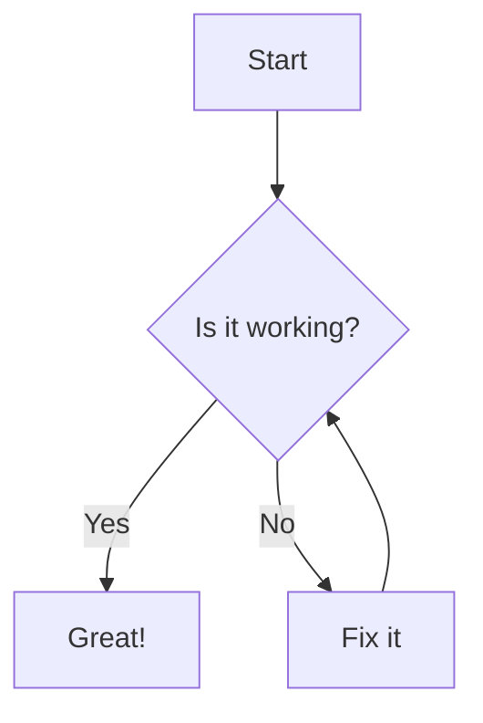

# PiDraw

> Universal diagram rendering platform — convert any diagram language to SVG or PNG.

PiDraw renders source code from **18 diagram languages** into optimized SVG and PNG. All formats work with **zero CLI tools** — just `pip install pidraw` and done. Includes native TikZ support, SVG optimization, quality enhancement, caching, parallel batch processing, file watching, plugin architecture, and async APIs.

**v1.3.0 is fully batteries-included** — no npm, no Java, no LaTeX, no separate plugin installs.

---

## Table of Contents

- [Installation](#installation)
- [Quick Start](#quick-start)
- [CLI Reference](#cli-reference)
- [Supported Formats](#supported-formats)
- [Batch Scripts (Windows)](#batch-scripts-windows)
- [Python API](#python-api)
- [Architecture](#architecture)
- [Caching](#caching)
- [Plugin System](#plugin-system)
- [Recovery & Error Handling](#recovery--error-handling)
- [Large File Support](#large-file-support)
- [Parallel Rendering](#parallel-rendering)
- [Requirements](#requirements)
- [License](#license)

---

## Installation

```bash
# Install from PyPI (recommended) — everything included
pip install pidraw

# Or install from source
git clone https://github.com/devasishpal/PiDraw.git
cd PiDraw
pip install -e .
```

That's it. All 18 diagram languages, all renderers, PNG export, and DOCX export work immediately with no extra tools.

---

## Quick Start

### 1. Create a diagram file

Save this as `flowchart.mmd`:



### 2. Render to SVG

```bash
pidraw render flowchart.mmd
# Output: flowchart.svg created
```

### 3. Render to PNG

```bash
pidraw render flowchart.mmd -f png
# Output: flowchart.png created
```

### 4. Detect language automatically

```bash
pidraw detect diagram.txt
# Output: Language: mermaid | Confidence: 98% | Renderer: MermaidRenderer
```

### 5. Analyze with full diagnostics

```bash
pidraw analyze diagram.puml
# Output: Language: plantuml, Confidence: 95%, Nodes: 3, Edges: 2, Warnings: 0
```

### 6. Batch render all diagrams in a folder

```bash
pidraw batch *.mmd --output-dir ./svg --optimize --workers 4
```

### 7. Watch for changes while editing

```bash
pidraw watch *.mmd --output-dir ./svg
# Watches for file changes and auto-renders on save
```

---

## CLI Reference

### `pidraw render <file> [options]`

Render a single diagram file to SVG or PNG.

| Option | Shorthand | Description | Default |
|--------|-----------|-------------|---------|
| `--output` | `-o` | Output file path | Auto-derived |
| `--language` | `-l` | Explicit diagram language | Auto-detected |
| `--format` | `-f` | Output format: `svg` or `png` | `svg` |
| `--optimize` | `-O` | Optimise the output SVG | Off |

**Examples:**

```bash
# Basic SVG render
pidraw render diagram.mmd

# Render to PNG
pidraw render diagram.mmd -f png -o output.png

# Force language (useful for ambiguous extensions)
pidraw render diagram.txt -l mermaid -o diagram.svg

# Render with optimization
pidraw render diagram.mmd -O -o optimized-output.svg
```

---

### `pidraw docs <file> [options]`

Render diagram code blocks in a Markdown file to HTML, Markdown, or DOCX.

| Option | Shorthand | Description | Default |
|--------|-----------|-------------|---------|
| `--output` | `-o` | Output file path | Auto-derived |
| `--output-format` | | `html`, `md`, or `docx` | `html` |
| `--format` | `-f` | Diagram format: `svg` or `png` | `svg` |
| `--no-bg` | | Remove background from diagrams | Off |

**Example:**

```bash
# Convert README with diagrams to a self-contained HTML page
pidraw docs README.md -o README-with-diagrams.html

# Output as Markdown with inline SVGs
pidraw docs README.md --output-format md

# Generate a DOCX for Word
pidraw docs README.md --output-format docx
```

---

### `pidraw detect <file> [options]`

Detect the diagram language used in a file.

**Example:**

```bash
pidraw detect unknown.diag
# Language: graphviz | Confidence: 92% | Renderer: GraphvizRenderer
```

---

### `pidraw analyze <file> [options]`

Full diagnostic report: detected language, confidence, renderer, element count, warnings, and optimization stats.

| Option | Description | Default |
|--------|-------------|---------|
| `--render` / `--no-render` | Run the renderer during analysis | `--render` |
| `--optimize` / `--no-optimize` | Optimize the output SVG | `--optimize` |

**Example:**

```bash
pidraw analyze large-diagram.mmd --no-render
# Language:     mermaid
# Confidence:   98%
# Nodes:        47
# Edges:        62
# Warnings:     none
# SVG length:   (skipped — render disabled)
```

---

### `pidraw optimize <file> [options]`

Optimize an existing SVG file (removes comments, metadata, unused defs, merges groups, etc.).

| Option | Shorthand | Description | Default |
|--------|-----------|-------------|---------|
| `--output` | `-o` | Output file path | Overwrites input |

**Example:**

```bash
pidraw optimize diagram.svg -o diagram-min.svg
# Before: 24.5 KB | After: 11.2 KB | Saved: 54%
```

---

### `pidraw batch <paths...> [options]`

Render multiple diagram files in parallel.

| Option | Shorthand | Description | Default |
|--------|-----------|-------------|---------|
| `--output-dir` | | Output directory for SVGs | Current directory |
| `--language` | `-l` | Language override for all files | Auto-detect |
| `--optimize` | `-O` | Enable optimization | Off |
| `--recursive` | `-r` | Scan directories recursively | Off |
| `--workers` | `-w` | Parallel worker count | CPU count |

**Examples:**

```bash
# Render all Mermaid files
pidraw batch *.mmd

# Recursive batch with 8 workers
pidraw batch ./docs -r -w 8 --output-dir ./rendered

# Batch render with optimization
pidraw batch *.mmd *.puml -O --output-dir ./svg-output
```

---

### `pidraw watch <paths...> [options]`

Watch files for changes and auto-render on every save.

| Option | Shorthand | Description | Default |
|--------|-----------|-------------|---------|
| `--output-dir` | | Output directory for SVGs | Current directory |
| `--language` | `-l` | Language override | Auto-detect |
| `--optimize` | `-O` | Enable optimization | Off |
| `--recursive` | `-r` | Watch subdirectories | Off |
| `--debounce` | | Debounce interval in seconds | `1.0` |

**Example:**

```bash
# Watch current directory, render on save
pidraw watch *.mmd --recursive

# Watch with 2-second debounce
pidraw watch *.mmd --debounce 2.0 --output-dir ./auto-rendered
```

---

### `pidraw plugins [options]`

List all registered and discovered renderer plugins.

```bash
pidraw plugins
# Total: 4 registered, 15 available renderers
```

---

### `pidraw version`

Show the PiDraw version.

```bash
pidraw version
# pidraw v1.3.0
```

---

### `pidraw formats [options]`

List all supported diagram formats with live availability status.

```bash
pidraw formats
```

Shows a table with availability, converter support, CLI tool requirements, and notes for each of the 14+ supported languages.

---

### `pidraw setup`

Auto-install missing CLI tools (npm packages, Java tools, Playwright browser).

```bash
pidraw setup
```

---

### `pidraw benchmark [--quick]`

Run the PiDraw benchmark suite to measure render speed, optimization performance, and cache efficiency.

```bash
pidraw benchmark
pidraw benchmark --quick
```

---

## Supported Formats

| Format | Language ID | File Extensions | Render Method |
|---|---|---|---|---|
| Mermaid | `mermaid` | `.mmd`, `.mermaid` | **Native** (pure Python) |
| PlantUML | `plantuml` | `.puml`, `.plantuml`, `.iuml` | **Native** (pure Python) |
| Graphviz DOT | `graphviz` | `.dot`, `.gv` | **Native** (pure Python) |
| D2 | `d2` | `.d2` | **Native** (pure Python) |
| ASCII Art | `ascii` | `.txt` | **Native** (pure Python) |
| Markmap | `markmap` | `.md`, `.mm` | **Native** (pure Python) |
| Nomnoml | `nomnoml` | `.noml` | **Native** (pure Python) |
| WaveDrom | `wavedrom` | `.json` | **Native** (pure Python) |
| Structurizr | `structurizr` | `.dsl` | **Native** (pure Python) |
| BPMN 2.0 | `bpmn` | `.bpmn` | **Native** (pure Python) |
| Vega | `vega` | `.json` | **Native** (pure Python) |
| Vega-Lite | `vega-lite` | `.json` | **Native** (pure Python) |
| Excalidraw | `excalidraw` | `.json`, `.excalidraw` | **Native** (pure Python) |
| TikZ | `tikz` | `.tex` | **Native** (pure Python, subset) |
| Kroki | `kroki` | `.txt`, `.kroki` | **HTTP API** (no CLI needed) |

**All 18 formats work immediately with just `pip install pidraw`** — zero CLI tools required. Mermaid advanced types (gitgraph, quadrantChart, xychart, timeline, journey, mindmap, zenuml, sankey, requirementDiagram) additionally support `mmdc` CLI for enhanced output.


---

## Python API

### Basic rendering

```python
from pidraw import render

# Mermaid
svg = render("graph TD; A-->B", language="mermaid")

# PlantUML
svg = render("@startuml\nA-->B\n@enduml", language="plantuml")

# Graphviz
svg = render("digraph { A -> B }", language="graphviz")

# D2
svg = render("A -> B", language="d2")

# Nomnoml
svg = render("[Customer]-[Order]", language="nomnoml")

# Markmap (markdown headings → mindmap)
svg = render("# Root\n## Section 1\n### Detail", language="markmap")

# Structurizr (C4 model)
svg = render('workspace {\n  model {\n    user = person "User"\n    system = softwareSystem "My System"\n    user -> system "Uses"\n  }\n}', language="structurizr")

# WaveDrom (timing diagrams)
svg = render('{"signal": [{"name": "clk", "wave": "P"}]}', language="wavedrom")

# Auto-detect language
svg = render("graph TD; A-->B")
```

### Optimization and quality

```python
from pidraw import render

# With optimization
svg = render(source, language="mermaid", optimize="balanced")

# With quality enhancement
svg = render(source, language="plantuml", quality=True)

# Maximum optimization (for production)
svg = render(source, language="graphviz", optimize="maximum")
```

### File-based rendering

```python
from pidraw import render_file

# Render from file path (auto-detect language)
svg = render_file("diagram.mmd")

# Explicit language
svg = render_file("diagram.txt", language="mermaid")

# With options
svg = render_file("diagram.puml", optimize="fast", quality=True)
```

### Async API

```python
import asyncio
from pidraw import arender

async def main():
    svg = await arender("graph TD; A-->B", language="mermaid")
    print(len(svg))

asyncio.run(main())
```

```python
from pidraw import arender_file

svg = await arender_file("diagram.mmd")
```

### Batch rendering

```python
from pidraw import render_many

sources = [
    "graph TD; A-->B",
    "@startuml\nA-->B\n@enduml",
    "digraph { A -> B }",
]
svgs = render_many(sources, language=None)  # auto-detect each
```

### Layout control

```python
from pidraw import render, LayoutType

# Force a specific layout engine
svg = render(source, language="mermaid", layout=LayoutType.LAYERED)
svg = render(source, language="graphviz", layout=LayoutType.TREE)
svg = render(source, language="d2", layout=LayoutType.GRID)
svg = render(source, language="plantuml", layout=LayoutType.FLOW)
```

### PNG conversion

```python
from pidraw.backend.png import svg_to_png

png_bytes = svg_to_png(svg_string, width=800, height=600)
with open("diagram.png", "wb") as f:
    f.write(png_bytes)
```

---

## Architecture

```
Source Code (string or file)
    │
    ▼
detect_language()  ──►  Language ID (e.g. "mermaid")
    │
    ▼
get_renderer(language)  ──►  Engine Registry
    │
      ├── NativeRenderer (for 10 converter-supported languages)
      │       ├── converter.parse(source) → Diagram model
      │       ├── apply_layout(diagram) → positioned nodes
      │       ├── apply_theme(diagram) → styled diagram
      │       └── SvgBackend.render(diagram) → SVG string
      │
      ├── CLI-Fallback Renderer (prefers CLI, falls back to native)
      │       ├── tikz → TikzConverter native fallback
      │       ├── bpmn → BPMN drawsvg native renderer
      │       ├── structurizr → StructurizrConverter native fallback
      │       ├── wavedrom → WaveDromNativeRenderer fallback
      │       ├── mermaid → MermaidConverter native fallback
      │       └── vega/vega-lite → vl-convert-python native
      │
      ├── KrokiRenderer (HTTP POST to kroki.io)
      │
      ├── ExcalidrawRenderer (pure Python JSON → SVG)
    │
    ▼
[Optional] optimize_svg(svg, level="balanced")
    │   10 passes: comments → metadata → defs → groups → paths → ...
    ▼
[Optional] QualityProcessor.process(svg)
    │   viewBox → text alignment → arrow heads → spacing → paths
    ▼
Output SVG string
```

### Engines

Each diagram format has a dedicated renderer engine in `pidraw/engines/`. Engines auto-register on import; if a CLI tool is missing and no native fallback exists, a placeholder is registered that raises a helpful error at render time.

### Converters

9 formats have pure-Python parsers (`pidraw/core/converters/`) that produce an internal `Diagram` model, which `SvgBackend` renders to SVG — no CLI tools needed:

| Converter | What it parses |
|---|---|---|
| `MermaidConverter` | `graph TD`, `flowchart`, `sequenceDiagram`, `classDiagram`, `stateDiagram`, `erDiagram`, `pie`, `gantt` |
| `PlantUMLConverter` | `@startuml` blocks, participants, actors, arrows |
| `GraphvizConverter` | `digraph`/`graph` statements with attributes |
| `D2Converter` | D2 node/edge syntax with shapes and styles |
| `ASCIIConverter` | Simple box-drawing diagrams (`+--+` boxes, `-->` arrows) |
| `NomnomlConverter` | nomnoml DSL (`[box]` syntax, arrows, associations) |
| `MarkmapConverter` | Markdown headings → mindmap tree |
| `StructurizrConverter` | Structurizr DSL (C4 model: persons, software systems, containers, relationships) |
| `TikzConverter` | TikZ `\node`/`\draw`/`\path` subset with shapes, colors, arrows |
| `WaveDromNativeRenderer` | WaveDrom JSON timing diagrams → SVG waveforms directly |

### SVG Optimizer

Three optimization levels (`pidraw/optimizer/`):

| Level | Passes | Description |
|---|---|---|
| `fast` | 3 | Remove comments, editor metadata, trim whitespace |
| `balanced` | 10 | All fast passes + unused defs, duplicate merging, group collapsing, empty elements, transform normalization, path simplification, attribute ordering |
| `maximum` | 10 | Same 10 passes (maximum available) |

### Layout Engines

4 layout strategies for native-rendered diagrams (`pidraw/layout/`):

| Engine | Algorithm |
|---|---|
| `FlowLayout` | Topological sort, single-row/column |
| `GridLayout` | Square-ish grid (√N columns) |
| `LayeredLayout` | Sugiyama-style layered layout |
| `TreeLayout` | Recursive subtree positioning |

### Themes

5 built-in themes (`pidraw/themes/`):

| Theme | Description |
|---|---|
| `light` | White background, dark text, sans-serif |
| `dark` | Dark background (`#1e1e1e`), light text |
| `minimal` | Light minimal (`#fafafa`), thin strokes, Helvetica |
| `professional` | Colorful node palette, shadows, Segoe UI |
| `blueprint` | Blue-on-light-blue, monospace, engineering aesthetic |

Apply a theme:

```python
from pidraw import render, apply_theme

svg = render("graph TD; A-->B", language="mermaid")
svg = apply_theme(svg, "dark")
```

---

## Caching

PiDraw includes a two-tier content-addressable cache:

- **Memory tier**: LRU-eviction dict (default 10,000 entries)
- **Disk tier**: JSON files in configurable directory
- Cache key: SHA-256 hash of `language + "\x00" + source`
- Configurable TTL per entry (default: 1 hour)

```python
from pidraw.cache import CacheManager

cache = CacheManager(enable_disk=True, ttl=3600)
```

Used automatically by `RenderPool` (parallel rendering) and `IncrementalRenderer`.

---

## Plugin System

Extend PiDraw with custom renderers via entry points:

```toml
# pyproject.toml
[project.entry-points."pidraw.renderers"]
myengine = "mypackage:MyRenderer"
```

Your class must extend `BaseRenderer` and implement `render(source: str) -> str`:

```python
from pidraw.engines.base import BaseRenderer

class MyRenderer(BaseRenderer):
    name = "myformat"
    
    def render(self, source: str) -> str:
        # ... return SVG string
        pass
```

Plugins are auto-discovered on import and appear in `pidraw plugins` output.

---

## Recovery & Error Handling

| Mechanism | Description |
|---|---|
| `render_with_retry()` | Exponential backoff retry with optional fallback renderer |
| `safe_render()` | Returns a red-box error SVG instead of raising |
| `RecoverableRenderingError` | Distinguishable from hard failures |

```python
from pidraw import safe_render, render_with_retry

# Never raises — returns error SVG on failure
svg = safe_render("graph TD; A-->B")

# Retry up to 3 times with backoff
svg = render_with_retry(source, language="mermaid", retries=3)
```

---

## Large File Support

Files up to 10 MB are handled with streaming reads and chunked SVG writes. Language detection reads only the first 512 KB for efficiency. The `render_large_file()` function provides memory-efficient processing:

```python
from pidraw import render_large_file
svg = render_large_file("massive-diagram.mmd")
```

---

## Parallel Rendering

`RenderPool` uses `ThreadPoolExecutor` (I/O-bound subprocess calls) or `ProcessPoolExecutor` (CPU-bound work) with auto-configured worker count.

```python
from pidraw import render_many

# Batch render 100 diagrams in parallel
sources = [f"graph TD; A{i}-->B{i}" for i in range(100)]
svgs = render_many(sources, language="mermaid")
```

---

## Requirements

- Python >= 3.10

**Everything works with just `pip install pidraw`** — no CLI tools, no Java, no Node.js, no LaTeX required. All 18 diagram languages, PNG export (via cairosvg), and DOCX export are included in the base install.

---

## License

MIT
